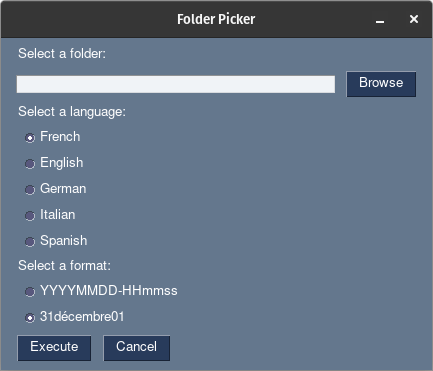

# Rename Images with Date Photo Taken

Purpose: Renames image files in a folder based on date photo taken from EXIF metadata

Improvement: Added a GUI with pysimpleGUI

Original Author: Matthew Renze

Updator: TH3VenGeur

Usage: python3 Rename.py 

Requirements:
 - pip3 install PySimpleGUI

Behavior:  
 - Given a photo named "Photo Apr 01, 5 54 17 PM.jpg"  
 - with EXIF date taken of "4/1/2018 5:54:17 PM"  
 - when you run this script on its parent folder:
   - it can rename the file to "20180401-175417.jpg"
   - or it can rename the file to 01april1, the last 1 is an increment to prevent duplication

Notes:
  - For safety, please make a backup before running this script
  - Currently only designed to work with .jpg, .jpeg, and .png files
  - EXIF metadate must exist or an error will occur
